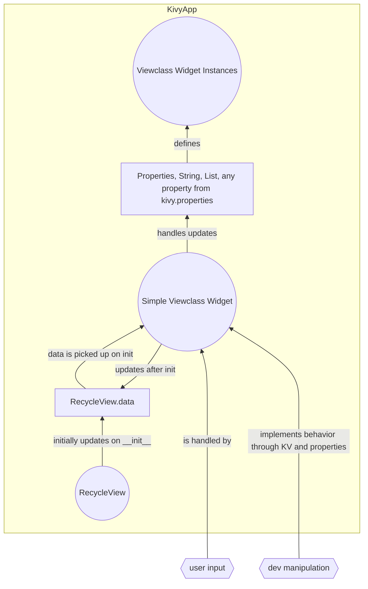
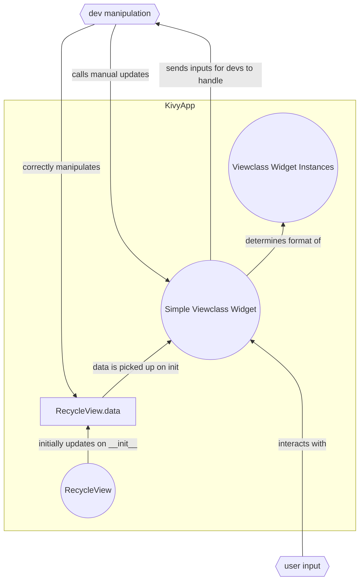

# recycleex
- [x] Recycleview VS Scrollview example and explanation
- [x] kivy recycleview tutorial DEEP DIVE for beginners: recycleview vs scrollview, examples, and analysis
- [x] github repo: https://github.com/kivy-school/recycleex
- [x] What is recycleview?
	- [x] a widget that displays a selection of many widgets at once
- [x] Why use recycleview? (telling) PT1
	- [x] very performant (not laggy)
	- [x] lets your app handle a LOT of data without having to DRAW the data (aka lag out your app)
	- [x] use case:
		- [x] handling inventory
		- [x] handling a library of songs
		- [x] handling complex widgets that are lagging out scrollview
		- [x] concrete example:
			- [x] note: using always on top = True
			- [x] have workers that you need to pay! (signified by the selection behavior)		
			- [x] `workers_paid.py`
- [x] WHY USE Recycleview  (showing) PT2
	- [x] basic example (from kivy org), `rvbasic.py`
		- [x] https://kivy.org/doc/stable/api-kivy.uix.recycleview.html
	- [x] basic example of scrollview: `scv.py`
		- [x] https://kivy.org/doc/stable/api-kivy.uix.scrollview.html
	- [x] recycleview VS scrollview (performance test)
	- [x] try at 1000 widgets
	- [x] try at 10000 widgets
	- [x] try at 100000 widgets
- [ ] EXAMPLES:
	- [x] basic example2 (from kivy org) `rvbasic2.py`
	- [x] elliot's example: https://www.reddit.com/r/kivy/comments/1d5y3jm/recycle_view_the_replacement_for_listview_but/
	- [ ] all the examples from kivy org
		- [x] PREREQ: "Kivy: How to Install and Run in Windows 2024 With Examples":
			- [ ] https://www.youtube.com/watch?v=qiIFJIqMHV0&t=148s
			- [x] `python -m pip install "kivy[base]" kivy_examples`
			- [x] Then you can run the code in place from .venv/share/kivy-examples/demo/kivycatalog/main.py
			- [x] https://www.reddit.com/r/kivy/comments/1d6dzvp/trying_to_get_this_example_from_kivyorgs_samples/
		- [x] basic_data
			- [x] populate, sort, clear
		- [x] inifinite_scrolling
			- [x] has infinite scroll
		- [x] key_viewclass
			- [x] `key_viewclass: 'widget'` means it will show your widget, and you are not locked to a fixed size for recycleview
		- [x] messenger
			- [x] messenger example
		- [x] pull_to_refresh
			- [x] (pull from top), self explanatory
		- [x] rv_animate
			- [x] has animation on press
		- [x] more examples from online:
			- [x] forceupdate.py has an updating textinput
			- [x] init_rv_data.py has an initialized list + updates
			- [x] screenmanagertoRV, has a screenmanager that goes to an RV in a screen
			- [x] SKIP: rvbasic3, rvbasic4
- [ ] REQUIREMENTS FOR A RECYCLEVIEW (use basic example 1)
	- [x] go LINE BY LINE on rv basic and elliot's example
		- [x] NOTE: using `Builder.load_string()` to load `kv` instead of having a separate `kv` file
	- [x] reference:  https://stackoverflow.com/a/68364350
	- [x] **#1: RV widget** CLASS (kv and py defs)
		- [x] means: USE BRACKETS
		- [x] `RV: != <RV>`
		- [x] `RV:` is a widget instance
		- [x] `<RV>` is the class definition
		- [x] see: https://kivy.org/doc/stable/guide/lang.html#rule-context
	- [x] **#2:  Layout** (kv and py defs)
		- [x] `SelectableRecycleBoxLayout`, `RecycleLayout`
	- [x] **#3:  actual viewclass**  (kv and py defs)
		- [x] defined as `viewclass:` or `key_viewclass`
	- [x] **#4: .data attribute**
		- [x] self.data (the data attribute of the recycleview widget that a list of dictionaries)
		- [x] could be something else, see ElliotDG line: 
			- [x] `data: self.rv_data_list`
		- [x] .data is a LIST and each element is a DICT
		- [x] Example:
			- [x] need: `data: data` AND it is a Listproperty
				- [x] equivalent to setting `rv.data` attribute
		- [x] proof: `type(self.data)`, `type(self.data[0])`, use `pdb` (line 68)
		- [x] `pdb hints`:
			- [x] `App.get_running_app().root`
			- [x] hint: in `ElliotDG.py`, just look at rv.data:  
			- [x] `App.get_running_app().root.ids['rv'].data`
			- [x] every widget needs an id for "widget drilling" to work?
		- [x] populated during `__init__`, can be updated at any time
	- [ ] **#5: ISSUES WITH WIDGET EXAMPLE FROM KIVY ORG:**
		- [x] ISSUE: forcing recycleview to update (**specifically updating in place in a deep level**), the example minimally modified does not do that for you
		- [x] Essence of the issue:
			- [x] https://kivy.org/doc/stable/api-kivy.properties.html#depth-being-tracked
			- [x] KV properties only track the top level
		- [x] how to force rv to update: 
			- [x] manually call `recycleview.refresh_from_data()`
		- [x] other solutions to update data:
			- [x] **SOLUTION 0** choose to reset rv.data (does not manually call `.refresh_from_data()`)
				- [x] example: `rv.data = [{'text': 'new data'}]`
				- [x] very bad if you have large data
				- [x] it will force an update
				- [x] DON'T DO IT!
			- [x] **SOLUTION 1** choose to update Properties (does not manually call `.refresh_from_data()`)
				- [x] ElliotDG's solution (standard solution): `declare interactdatalist as a kivy ListProperty`
				- [x] https://www.reddit.com/r/kivy/comments/zzmkg0/comment/j2e456n/?utm_source=share&utm_medium=web3x&utm_name=web3xcss&utm_term=1&utm_content=share_button
				- [x] use kv structure itself to force automatic updates
			- [x] **SOLUTION 2**  choose to update the recycleview data itself +  force rv to update with `recycleview.refresh_from_data()`
				- [x] my solution (use RecycleKVIDsDataViewBehavior)
					- [x] https://kivy.org/doc/stable/api-kivy.uix.recycleview.views.html
					- [x] I SPENT 4 DAYS LOOKING FOR THIS (I thought it was default behavior all this time)
				- [x] you might have to reference viewclass widgets by ID 
				- [x] OPINION: makes it easier to make and handle complex viewclass widgets
	
| SOLUTION 1 (ELLIOTDG) PRO  | SOLUTION 1(ELLIOTDG) CON |
|--|--|
| structure is flat (handle everything through Viewclass Widget and properties) | you have to manually remember to property EVERYTHING |
| have to set everything up correctly| a bit hard to manipulate the boxlayout viewclass as easily (I have been trying for 2 days)| 
||still might have to call refresh_from_data if you modify data in place |
||not everything can be done in kv (kv lang MUST be perfectly set up)|
||method is the best, but also easier if you are an expert. |

**What I mean by a flat structure of Solution 1, all you have to handle is Viewclass Widget and Properties**
- [x] handle KV
- [x] declare everything as a property correctly
- [x] structure the app to be easy to make with kv (not always possible or immediately obvious, like with complex apps)
- [x] might have to manually force update anyways

| SOLUTION 2 (KIVYSCHOOL/PENGUIN) PRO  | SOLUTION 2 (KIVYSCHOOL/PENGUIN) CON |
|--|--|
| can use/manipulate very complex widgets by referencing with id |  you must manually update the recycleview with `recycleview.refresh_from_data()`. easiest way is on_touch_down, `on_touch_up` looks laggy |
|all you have to do is set ids|more complicated to update from kv after init, you cannot reference recycleview data because it is not instantiated yet		|
|You can modify kv at any time|calling rv.refresh_from_data() from viewclass causes infinite refreshes (because each viewclass widget will cause a refresh...)|
|color example `App.get_running_app().root.data[index]['employee_name_labelID.color'] = (170,170,170)`|SelectableBoxLayout's apply_selection will have infinite updates|
| trade in property structure for id structure (which you NEED for widget drilling). Widget drilling is `App.get_running_app().root.ids ids ids ids....` | have to manually call refresh_from_data  |
|  ||

- [x]  you have to keep track of 2 things: Recycleview data and forcing updates 
- [x] my expectation is that manipulating data forces an update. It is not always the case with updating data in place, so `recycleview.refresh_from_data()` may be required.  

**Structure of Solution 2, the dev must handle RecycleView Data and manual refreshes**

- [x] why 2 parents at `self.parent.parent.refresh_from_data()` in `workers_paid.py`?
	- [x] use pdb
		- [x] notes:
			- [ ] canvas.before goes before everything else
			- [ ] **how to use pdb to check out what's going on:**
				- [x] `workers_paid`, on touch down set trace
				- [x] example: flipping sadface to happy face (since they got paid)
				- [ ] get running app 
					- [ ] https://kivy.org/doc/stable/api-kivy.app.html#kivy.app.App.get_running_app
				- [ ] get root: `App.get_running_app().root`
				- [ ] check out id's (nothing)
				- [ ] check out .children[0]
				- [ ] check out self
				- [ ] check out `__name__`
				- [ ] check out `dir()`
				- [ ] `exit`
				- [ ] get args: `args`

- [ ] =-=-=-==-=-=-==-=-= **FINISH !** =-==-=-=-==-=-=-==-=-=-=
